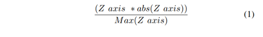
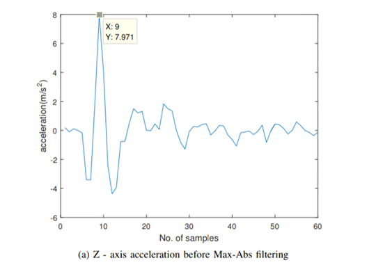
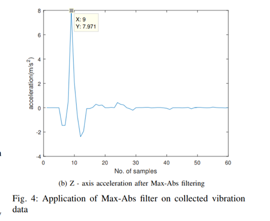

Sources: 

-  [https://www.researchgate.net/publication/317918892](https://www.researchgate.net/publication/317918892?fbclid=IwAR0tP3XDGXy81UlMOT9whiRUiYAsamMZMroSvq4uztEYyFkDh6qfyEwhneI)
  Vehicle Vibration Signal Processing for Road Surface Monitoring    (I took concept of max abs filter )

- [https://www.researchgate.net/publication/289226869](https://www.researchgate.net/publication/289226869?fbclid=IwAR3r3JqmdvvMgAKW3MGblwI7z_7E5AirIS2Xjl9Q6gsz_XpyvrYY_gvkVQs)
  Accelerometer based road defects identification system (only use 0.8*g as threshold)

- https://pimylifeup.com/raspberry-pi-accelerometer-adxl345/

- problem :
  - every road has some of these : 
  - it makes our trips harder to finish
  - it ruins our cars 
  - we have to detect them to fix them 

- Solution :
  - know forces that affects our car gives us how car went up or down .....but how it's done ?
  - 
  gives forces in 3 directions 
  - [xyz](xyz.png)
  - it tells us when signifigant increase or decrease in Z direction (when car falls)

Scenario :  

- read accleration data in x,y,z 

- `smooth_accl(arrx,arry=None,arrz=None): `

  - uses max abs filter to detect abnormal acceleration  only  : 

    used for smoothing signal (signal comes with noise):

    

after apply filter : signal becomes : we can see that we only maintained the abnormal change while others minimized  

 

- detect abnormal event for ensuring that maximum of z acceleration is larger than 0.8g and other values is about 0 and lasts for 80% of the time during sampling
- if abnormal happens send location of GPS
- `calc_speed(arrx,step,arry=None,arrz=None):` uses Romberg integration to calculate speed from acceleration  after smoothing in x,y,z 
  - for romberg integrattion samples number is 2^k+1 
- calculate sum of speed speed= sqrt(sppedx^2+speedy^2+speedz^2)
